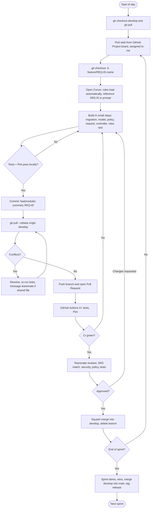

# CRM System - Build and Implementation Plan

**Team:** 2 developers (Dev A, Dev B) working in parallel through GitHub
**Source of truth:** CRM Requirements Specification v1.0 (SRS)
**Locked stack (SRS cover page):** Laravel, HTML, PHP, MySQL

---

## 1. Ground rules and how the two documents were reconciled

| Topic | Cursor guide says | This project uses (per SRS) |
|---|---|---|
| Backend | Laravel 11 | Laravel (11+), PHP |
| Frontend | Vue 3 + Inertia.js | **Blade + HTML + CSS + vanilla JS** |
| Database | PostgreSQL | **MySQL** |
| Cursor rules, prompting, Composer, commit-often, review checklist | Yes | **Kept and tailored** (see `cursor-rules/`) |

- The SRS asks for a "single-page" feel. With HTML/Blade this is met through server-rendered pages plus `fetch()` for live pieces (search suggestions, inline task completion, calendar drag-and-drop, dashboard widgets). No SPA framework is introduced.
- Charts (funnel, donut) and calendar need a JS library. Suggested: Chart.js and FullCalendar. These are plain JS libraries, not a stack change, but agree on them in Phase 0.
- Priorities follow SRS 9.2: P0 first, then P1, then P2. **P3 is out of scope.**
- FR-HOME-007 (Assistant recommendations) is built as simple rule-based queries (30+ days inactive, stale close dates), not AI, so it does not conflict with the P3 "AI insights" exclusion.

## 2. Ownership (to avoid merge conflicts)

| Dev A - "Identity, Service and Data" | Dev B - "Sales, Activity and Analytics" |
|---|---|
| Auth, RBAC, policies, users admin | Base layout, navigation, Blade components |
| Accounts, Contacts | Leads and lead conversion |
| Cases | Opportunities and stages |
| Global and advanced search | Home dashboard widgets |
| Tasks, email/notifications, queues | Events and calendar |
| Import/export, attachments, MFA, REST API | Report builder, dashboards, hierarchy |

Shared files (layout, nav, `routes/web.php`, `bootstrap/app.php`) are edited only in small, quickly merged PRs. Use one route file per module (`routes/leads.php`, etc.).

## 3. GitHub workflow

- Branches: `main` (release), `develop` (integration), `feature/REQ-ID-name`. Both protected: PR required, 1 approval from the other developer, CI green.
- Commits: Conventional Commits with SRS ID, e.g. `feat(opportunities): stage probability auto-update [FR-OPP-003]`.
- Project board columns: Backlog, In Progress, In Review, Done. One issue per requirement ID.
- 2-week sprints, 15-minute daily sync, sprint demo + retro, tag a release at each sprint end.
- Rebase on `develop` daily. Migrations already on `develop` are never edited.
- CI (GitHub Actions): `composer install`, MySQL service, `php artisan test`, `pint --test`.

## 4. Phases

### Phase 0 - Setup and Governance (Week 1, both devs)
- Create GitHub repo, branch protection, issue templates, project board, PR template.
- Create Laravel project with MySQL; Docker Compose (php, mysql, mailpit for local email).
- Copy `cursor-rules/*.mdc` into `.cursor/rules/`, paste `USER_RULES.txt` into Cursor Settings, commit.
- Add CSS design tokens from SRS section 6, base layout skeleton, GitHub Actions CI.
- Turn the SRS into GitHub issues (one per FR/NFR ID) and label P0/P1/P2.
- **Exit:** both devs can clone, run, and open a PR that passes CI.

### Phase 1 - Foundation (Weeks 2-3)
| Dev A | Dev B |
|---|---|
| FR-AUTH-001 login, lockout (5 attempts), 2h timeout, remember-me | Layout: header, global search box (UI only), 10 primary tabs, footer |
| FR-AUTH-002 password reset, 1h token, no reuse of last 5 | Blade components: data table, form field, modal, toast, related list |
| FR-AUTH-003 roles, permissions, policies, sharing rules | List helpers: sorting, pagination (max 200), column show/hide |
| Users admin screen, role seeder | `HasAuditFields` trait, picklist seeders, demo data seeder |

**Exit:** login works by role, layout in place, first empty module renders inside it.

### Phase 2 - Core Objects, P0 (Weeks 4-7)
| Dev A | Dev B |
|---|---|
| **Merge Accounts migration on day 1** (others depend on it) | Leads migration, model, policy |
| FR-ACCT-001..003 list, create, detail, related lists, Copy billing to shipping | FR-LEAD-001..004 list, create/edit, detail, quick actions |
| FR-CONT-001..003 contacts with required Account, Reports To | FR-LEAD-006 statuses, FR-LEAD-007 assignment and ownership history |
| Bulk actions: change owner, delete | Bulk actions: owner, status, delete |

**Exit:** Accounts, Contacts, Leads fully usable with role-based access, tests passing.

### Phase 3 - Sales, Service, Search and Basic Reports, P0 (Weeks 8-9)
| Dev A | Dev B |
|---|---|
| FR-CASE-001..004 cases, auto case number, closed = read-only, reopen | FR-OPP-001..006 opportunities, stage to probability, stage history, stage path |
| FR-SRCH-001/002 global search: 2-char suggestions, top 5 per object, results page, recent searches | Opportunity validations, clone, archive |
| Pre-built reports: leads and case reports (FR-RPT-002) | FR-HOME-001..003, 006 pipeline funnel, revenue-by-source donut, key deals, recent records |
| | Pre-built opportunity reports (FR-RPT-002/004) |

**Exit:** every P0 item in SRS 9.2 works. **Milestone: MVP demo.**

### Phase 4 - Productivity and Analytics, P1 (Weeks 10-13)
| Dev A | Dev B |
|---|---|
| FR-TASK-001..003 tasks, polymorphic related-to, reminders | FR-CAL-001..004 events, calendar day/week/month/table, drag-and-drop |
| Email: templates, merge fields, task-assignment, owner-change, reset emails (queues + scheduler) | FR-LEAD-005 lead conversion wizard (transaction, read-only after) |
| Daily digest and overdue notifications | FR-RPT-003 report builder, FR-RPT-005 export CSV/Excel/PDF |
| FR-HOME-004/005 dependency: expose tasks/events queries | FR-DASH-001..004 dashboard builder and filters, FR-HOME-004/005 widgets |
| Data import/export (CSV, field mapping, error report) | |

**Exit:** all P1 items working; critical journeys (lead conversion, opportunity closure, case resolution) covered by tests.

### Phase 5 - Enhancements, P2 (Weeks 14-15)
| Dev A | Dev B |
|---|---|
| FR-SRCH-003 advanced search, saved searches | FR-ACCT-004 account hierarchy and roll-ups |
| FR-RPT-006 report subscriptions | FR-DASH-003 auto-refresh (5/10/30/60 min) |
| Attachments (25MB, type whitelist, preview, virus scan) | FR-HOME-007 assistant recommendations (rule-based) |
| MFA (optional), REST API with OpenAPI docs (SRS 8.3) | Polish UI, empty states, tooltips, breadcrumbs |

### Phase 6 - Hardening and QA (Week 16, both)
- Unit coverage >= 80%; feature tests for every requirement ID.
- Performance: seed 100k+ rows, tune indexes; verify NFR-PERF targets and 100 concurrent users.
- Security: OWASP checks, authorization tests, dependency scan.
- Accessibility (WCAG 2.1 AA), responsive (320px+), Chrome/Firefox/Safari/Edge.
- GDPR: export and delete personal data, audit trail review.

### Phase 7 - Deployment and Handover (Week 17, both)
- Production Dockerfile, environments (dev/staging/prod), CI/CD deploy, rollback procedure.
- Health endpoint, logging/monitoring, daily backups with 30-day retention.
- UAT on staging, fix list, production release, tag `v1.0.0`.
- Docs: architecture and schema, API (OpenAPI), deployment guide, dev setup, user and admin guides.

## 5. Timeline summary

| Sprint | Weeks | Phase | Outcome |
|---|---|---|---|
| 0 | 1 | Phase 0 | Repo, environment, CI, rules |
| 1 | 2-3 | Phase 1 | Auth, RBAC, layout |
| 2-3 | 4-7 | Phase 2 | Accounts, Contacts, Leads |
| 4 | 8-9 | Phase 3 | Cases, Opportunities, search, home, basic reports (MVP) |
| 5-6 | 10-13 | Phase 4 | Tasks, calendar, conversion, builders, email |
| 7 | 14-15 | Phase 5 | P2 features |
| 8 | 16-17 | Phases 6-7 | QA, release |

Estimated ~17 weeks for two developers; adjust once you set your real deadline and capacity.

## 6. Risks and mitigations

| Risk | Mitigation |
|---|---|
| Merge conflicts in shared files | Ownership table, per-module routes, small PRs, daily rebase |
| Dev B blocked by Accounts (lead conversion, opportunities) | Dev A merges Accounts schema on day 1 of Phase 2 |
| Cursor generating Vue/Inertia/Postgres code from habit | `crm-core.mdc` locks the stack; reviewer checks in every PR |
| Report builder and dashboards are the most complex | Start after pre-built reports exist; reuse their query layer |
| Record-level security missed in some queries | Central query scope per model + authorization tests per role |
| Scope creep into P3 | Any P3 request needs both devs' approval |

## 7. Definition of Done (per feature)

Migration + model + policy + FormRequest + controller + Blade views + tests, SRS ID referenced, validation and audit fields present, responsive and accessible, Pint clean, CI green, approved by the other developer, merged to `develop`.

## 8. Cursor usage per phase

Follow the guide's approach: Composer for multi-file features, `@file` references for context, commit before large runs, and the guide's review prompt (security, N+1, validation, unused imports, style) before each PR. Example kickoff prompt:

```
Using @docs/SRS and the crm rules, implement FR-OPP-003 (stages and probability).
Files: migration for stage_history, Opportunity model, StageService, OpportunityController@updateStage,
Blade stage-path component, feature tests. Stack: Laravel + Blade + MySQL only.
```

---

## 9. Flowcharts

Diagram files are also provided separately as `.mermaid` files.

### 9.1 Project phases and team split

```mermaid
flowchart TD
    S([Start: SRS signed off]) --> P0

    subgraph P0["PHASE 0 - Setup and Governance - both devs, Week 1"]
        A0["Create GitHub repo, branch protection, main and develop"]
        B0["Laravel + MySQL + Docker dev env, CI pipeline"]
        C0["Add Cursor rules, base layout shell, design tokens"]
        A0 --> B0 --> C0
    end

    P0 --> P1

    subgraph P1["PHASE 1 - Foundation - Weeks 2-3"]
        direction LR
        A1["DEV A: Login, lockout, session timeout, password reset, RBAC, policies, users admin"]
        B1["DEV B: Layout, nav tabs, Blade components, list-view and form helpers, audit trait, seeders"]
    end

    P1 --> G1{"Gate 1: Auth + layout merged to develop?"}
    G1 -- No --> P1
    G1 -- Yes --> P2

    subgraph P2["PHASE 2 - Core Objects P0 - Weeks 4-7"]
        direction LR
        A2["DEV A: Accounts then Contacts: CRUD, lists, detail pages, related lists"]
        B2["DEV B: Leads: CRUD, list, detail, statuses, assignment, bulk actions"]
    end

    P2 --> G2{"Gate 2: Accounts, Contacts, Leads demo-ready?"}
    G2 -- No --> P2
    G2 -- Yes --> P3

    subgraph P3["PHASE 3 - Sales, Service, Search and Basic Reports P0 - Weeks 8-9"]
        direction LR
        A3["DEV A: Cases + status workflow, global search, lead and case reports"]
        B3["DEV B: Opportunities + stages, home dashboard widgets, pipeline reports"]
    end

    P3 --> G3{"Gate 3: All P0 features working and tested?"}
    G3 -- No --> P3
    G3 -- Yes --> P4

    subgraph P4["PHASE 4 - Productivity and Analytics P1 - Weeks 10-13"]
        direction LR
        A4["DEV A: Tasks, email notifications, queues + scheduler, import/export"]
        B4["DEV B: Events + calendar, lead conversion, report builder, dashboard builder"]
    end

    P4 --> G4{"Gate 4: P1 complete, sprint demo approved?"}
    G4 -- No --> P4
    G4 -- Yes --> P5

    subgraph P5["PHASE 5 - Enhancements P2 - Weeks 14-15"]
        direction LR
        A5["DEV A: MFA, attachments + scan, advanced search, report subscriptions, REST API"]
        B5["DEV B: Account hierarchy, dashboard auto-refresh, assistant recommendations"]
    end

    P5 --> P6

    subgraph P6["PHASE 6 - Hardening and QA - Week 16"]
        T1["Coverage 80%, security and load tests, WCAG AA, cross-browser, GDPR features"]
    end

    P6 --> G5{"Gate 5: All tests green, no critical bugs?"}
    G5 -- No --> P6
    G5 -- Yes --> P7

    subgraph P7["PHASE 7 - Deployment and Handover - Week 17"]
        D1["Docker images, staging, UAT, production release, docs"]
    end

    P7 --> E([Go-live and handover])
```


### 9.2 Daily GitHub collaboration workflow


